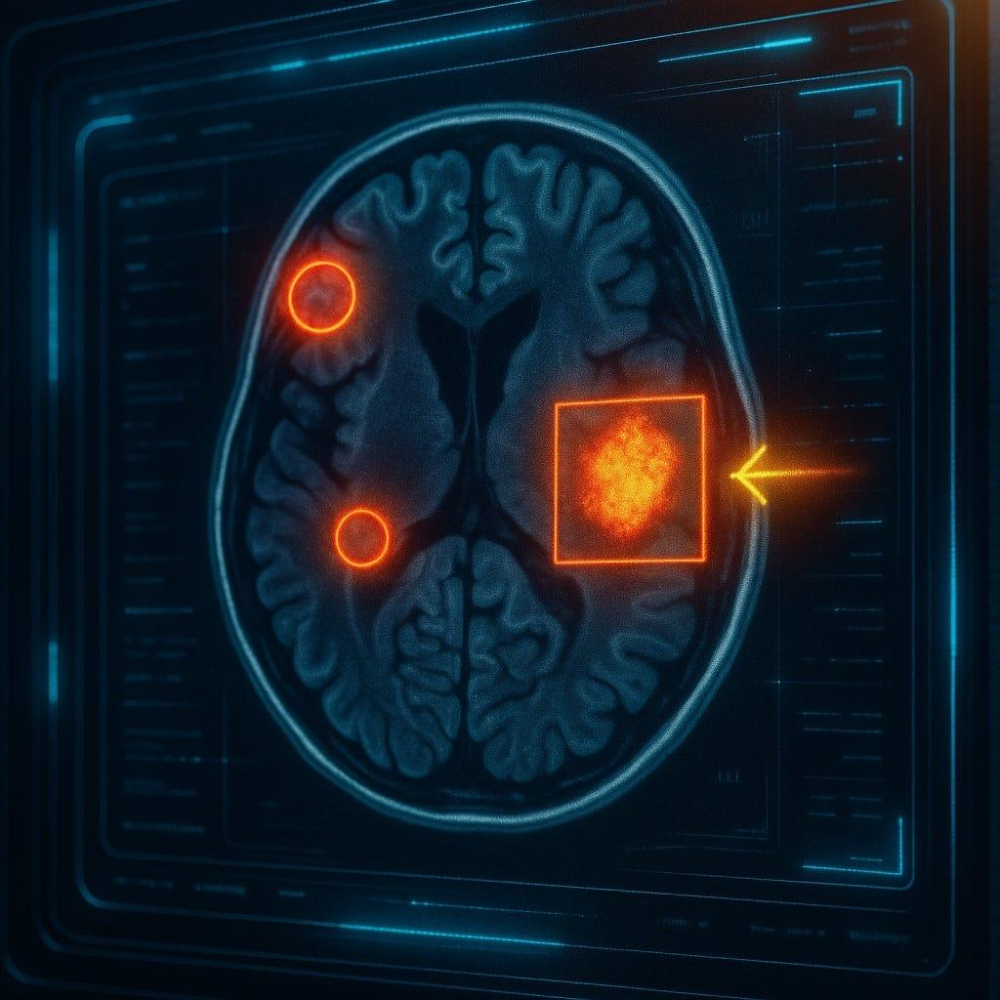
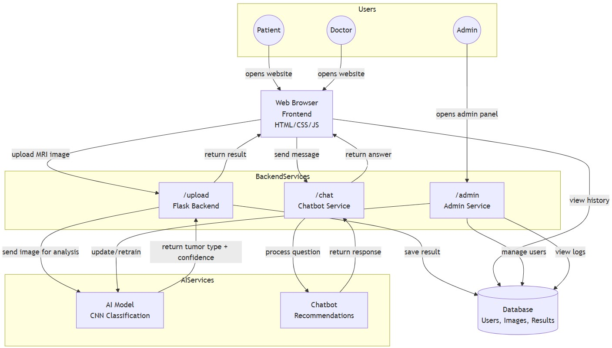

<div align="center">



# 🧠 AI Brain Tumor Detection System

### *An Integrated AI-Powered System for Brain Tumor Detection, Classification, Segmentation, and Patient Consultation using MRI Images*

[](https://www.python.org/)
[](https://tensorflow.org/)
[](https://fastapi.tiangolo.com/)
[](#-results)
[](LICENSE)

**Graduation Project — HIT Academy, Higher Institute of Technology**


</div>

## 📑 Table of Contents

<details open>
<summary><b>📖 Overview</b></summary>

- [🧠 About the Project](#-about-the-project)
- [🎯 Project Objectives](#-project-objectives)
- [✨ Key Features](#-key-features)

</details>

<details open>
<summary><b>🏗️ System Design</b></summary>

- [🏗️ System Overview](#️-system-overview)
- [🔄 System Workflow](#-system-workflow)
- [🏛️ System Architecture](#️-system-architecture)
- [🗄️ Database Design](#️-database-design)
- [🔌 API Documentation](#-api-documentation)

</details>

<details open>
<summary><b>🤖 AI Components</b></summary>

- [Classification](#classification)
- [Segmentation](#segmentation)
- [Medical Recommendation Engine](#medical-recommendation-engine)
- [AI Chatbot](#ai-chatbot)

</details>

<details open>
<summary><b>📊 Data & Results</b></summary>

- [📊 Dataset](#-dataset)
- [🧪 Model Training & Evaluation](#-model-training--evaluation)
- [📈 Results](#-results)
- [🖥️ Screenshots](#️-screenshots)

</details>

<details open>
<summary><b>🌐 Web Application</b></summary>

- [🌐 Web Application](#-web-application)
- [👥 User Roles](#-user-roles)

</details>

<details open>
<summary><b>⚙️ Development</b></summary>

- [📁 Project Structure](#-project-structure)
- [⚙️ Technologies Used](#️-technologies-used)
- [🚀 Installation & Setup](#-installation--setup)
- [▶️ Usage](#️-usage)

</details>

<details open>
<summary><b>📚 Additional Info</b></summary>

- [📚 Project Documentation](#-project-documentation)
- [🔮 Future Work](#-future-work)
- [⚠️ Disclaimer](#️-disclaimer)
- [👨‍💻 Team](#-team)

</details>


# 🧠 About the Project

> **An Integrated AI-Powered System for Brain Tumor Detection, Classification, Segmentation, and Patient Consultation using MRI Images.**

Brain tumors are one of the most aggressive forms of cancer and a leading cause of death worldwide, with approximately **300,000 new cases diagnosed annually** according to the World Health Organization (WHO). Early and accurate diagnosis is critical for improving patient outcomes and treatment planning.

However, traditional manual interpretation of MRI scans by radiologists faces several challenges:

- ⏱️ **Time-consuming** analysis of hundreds of MRI slices per patient
- 🎭 **Inter-reader variability** — diagnosis heavily depends on radiologist experience
- 🔍 **Difficulty differentiating** between similar tumor types (Glioma, Meningioma, Pituitary)
- 🩺 **Limited access** to specialized neuro-radiologists in many regions
- 📉 **Human error** in detecting small or early-stage tumors

This project presents a **complete, integrated AI-based solution** that addresses these challenges by combining **three intelligent components** into a single, user-friendly platform:

<table>
<tr>
<td align="center" width="33%">

### 🔬
**Classification**

Deep learning CNN that detects and classifies brain tumors into 4 categories with **98.47% accuracy**.

</td>
<td align="center" width="33%">

### 🎯
**Segmentation**

Lightweight LSMAtt-Net that precisely delineates tumor boundaries with only **1.39M parameters**.

</td>
<td align="center" width="33%">

### 💬
**Recommendation Engine**

Intelligent chatbot that provides personalized medical advice based on tumor type and risk level.

</td>
</tr>
</table>

Unlike existing solutions that focus on classification or segmentation in isolation, our system provides an **end-to-end pipeline**: from MRI image upload, through AI-powered analysis, to bilingual PDF reports and patient consultation — all within a secure, role-based web application.

---

## ✨ Why This Project?

| Challenge | Our Solution |
|-----------|-------------|
| Manual diagnosis is slow and subjective | ⚡ **AI-powered diagnosis in seconds** |
| Classification and segmentation are separate | 🔗 **Unified pipeline** in one system |
| Lack of interpretable AI tools | 🎯 **Precise tumor boundary visualization** |
| Patients struggle to understand results | 💬 **Bilingual reports + medical chatbot** |
| No role differentiation in existing tools | 👥 **Patient / Doctor / Admin roles** |
| Medical datasets are imbalanced | ⚖️ **Balanced 16,696-image dataset** |

---

## 📌 Project Info

| | |
|---|---|
| **Project Type** | Graduation Project |
| **Institution** | HIT Academy — Higher Institute of Technology |
| **Department** | Information Technology |
| **Supervisor** | Dr. Hala Ahmed Ali |
| **Academic Year** | 2025 – 2026 |
| **Status** | ✅ Completed |

---

<div align="center">

### 💬 *"Early detection saves lives. AI makes early detection possible."*

</div>


# 🎯 Project Objectives

This project aims to develop an **integrated and interpretable AI system** for brain tumor diagnosis using MRI images. The specific objectives are:

<table>
<tr>
<td width="50%" valign="top">

### 1️⃣ Tumor Detection

Develop an AI model for brain tumor detection in MRI images to accurately detect the **presence or absence** of a brain tumor.

</td>
<td width="50%" valign="top">

### 2️⃣ Multi-Class Classification

Classify tumors into **four types**: Glioma, Meningioma, Pituitary, and No Tumor using Deep Learning techniques.

</td>
</tr>
<tr>
<td width="50%" valign="top">

### 3️⃣ Tumor Segmentation

Perform tumor segmentation by drawing boundaries around the affected area to precisely **delineate tumor boundaries** and visualize the affected region.

</td>
<td width="50%" valign="top">

### 4️⃣ Address Data Challenges

Apply **data augmentation** techniques to artificially expand the training dataset and mitigate the effects of class imbalance, improving model generalization and robustness.

</td>
</tr>
<tr>
<td width="50%" valign="top">

### 5️⃣ Ensure Interpretability

Utilize **Explainable AI (XAI)** techniques to provide visual explanations of model decisions, highlighting the image regions that most influence the classification. This is crucial for building trust and enabling clinical validation.

</td>
<td width="50%" valign="top">

### 6️⃣ Build a Medical Chatbot

Develop a **medical chatbot** for patient consultation to provide quick medical advice and assist patients in understanding their diagnosis.

</td>
</tr>
<tr>
<td colspan="2" align="center" valign="top">

### 7️⃣ Create a User-Friendly Interface

Create a **user-friendly web interface** enabling users to upload images and get results quickly — accessible to both patients and medical professionals.

</td>
</tr>
</table>


# ✨ Key Features

<table>
<tr>
<td width="50%" valign="top">

### 🔬 Multi-Class Tumor Classification

- **4-class classification**: Glioma, Meningioma, Pituitary, and No Tumor
- **98.47% accuracy** on 3,340 test images
- **Perfect 100% recall** for the No Tumor class (zero false negatives for healthy cases)
- Custom CNN architecture with **13M+ parameters** trained from scratch

</td>
<td width="50%" valign="top">

### 🎯 Precise Tumor Segmentation

- **LSMAtt-Net** architecture with only **1.39M parameters (5.5 MB)**
- **100% tumor detection rate** on test images
- **Best IoU of 92.40%** — outperforming standard U-Net and Attention U-Net
- Lightweight design suitable for resource-constrained environments

</td>
</tr>
<tr>
<td width="50%" valign="top">

### 💬 Intelligent Medical Chatbot

- Rule-based recommendation engine with risk-level calculation
- Personalized medical advice based on **tumor type + size**
- Two-step conversation flow (tumor type → size → recommendations)
- Conversation history persistence

</td>
<td width="50%" valign="top">

### 🖥️ Full-Stack Web Application

- **Backend**: FastAPI REST API (Port 8000) with auto-generated Swagger/ReDoc docs
- **Frontend**: Responsive HTML/CSS/JavaScript single-page application
- **Database**: SQLite with SQLAlchemy ORM (7 relational tables)
- **Authentication**: JWT tokens with 30-minute expiry and blacklist support

</td>
</tr>
<tr>
<td width="50%" valign="top">

### 📄 Bilingual PDF Reports

- Downloadable diagnosis reports in **Arabic and English**
- Includes tumor type, risk level, medical recommendations, and MRI image
- Generated via `html2canvas` + `jsPDF`
- Professional medical report format

</td>
<td width="50%" valign="top">

### 👥 Role-Based Access Control

- **Patient**: Upload images, view results, chat, download reports
- **Doctor**: All patient privileges + view all patients, add medical notes, verify diagnoses
- **Admin**: Full system access, user management, model retraining, system logs

</td>
</tr>
</table>


# 🏗️ System Overview

Our system is built as a **complete end-to-end pipeline** that takes an MRI image as input and produces a comprehensive diagnosis with medical recommendations. The system consists of **three main AI components** integrated into a single web platform.

<br>

<div align="center">



<sub><i>Figure 1: Overall System Architecture — Users, Frontend, Backend Services, AI Services, and Database</i></sub>

</div>

<br>

<table>
<tr>
<td align="center" width="33%" valign="top">

## 1️⃣

### 🧠 Input

**MRI Image**

User uploads an MRI scan through the web interface.

</td>
<td align="center" width="33%" valign="top">

## 2️⃣

### ⚙️ Processing

**AI Analysis**

The image is preprocessed and passed through the AI models.

</td>
<td align="center" width="33%" valign="top">

## 3️⃣

### 📊 Output

**Diagnosis + Report**

User receives diagnosis, recommendations, and bilingual PDF report.

</td>
</tr>
</table>

<br>

## 🔑 Core Components

<table>
<tr>
<td width="50%" valign="top">

### 🔬 Classification Module

Analyzes the MRI image and classifies it into one of **four categories**:

- **Glioma** — Tumor in glial cells
- **Meningioma** — Tumor in meninges
- **Pituitary** — Tumor in pituitary gland
- **No Tumor** — Healthy brain

**Output:** Tumor type + Confidence score (%)

</td>
<td width="50%" valign="top">

### 🎯 Segmentation Module

Delineates the **exact boundaries** of the tumor region:

- Produces a **binary mask** (tumor vs. background)
- Overlays the mask on the original MRI
- Provides **visual localization** of the tumor
- Assists in surgical planning

**Output:** Segmented tumor overlay

</td>
</tr>
<tr>
<td width="50%" valign="top">

### 💬 Recommendation Engine

Provides **personalized medical advice** based on:

- Tumor type (Glioma / Meningioma / Pituitary)
- Tumor size (Small / Medium / Large)
- Calculated **risk level** (Low / Medium / High)

**Output:** Tailored recommendations + Chatbot response

</td>
<td width="50%" valign="top">

### 🖥️ Web Application

A **full-stack platform** that integrates everything:

- **Secure authentication** (JWT-based)
- **Role-based access** (Patient / Doctor / Admin)
- **Bilingual PDF reports** (Arabic & English)
- **Diagnosis history** tracking
- **Chatbot interface** for consultation

**Output:** Complete user experience

</td>
</tr>
</table>

<br>

## 🎯 System Capabilities

| Capability | Description |
|------------|-------------|
| 🔍 **Detect** | Identify the presence or absence of a brain tumor |
| 🏷️ **Classify** | Determine the specific tumor type (4 classes) |
| 🎯 **Segment** | Draw precise boundaries around the tumor |
| 📊 **Assess** | Calculate a risk level based on tumor characteristics |
| 💬 **Recommend** | Provide personalized medical recommendations |
| 📄 **Report** | Generate bilingual PDF reports |
| 💾 **Store** | Save all diagnoses with full history tracking |
| 👥 **Manage** | Role-based access for patients, doctors, and admins |


# 🔄 System Workflow

The system follows a **clear, step-by-step workflow** from image upload to diagnosis and reporting. Below is the complete flow:

<br>

## 📋 End-to-End Workflow

<table>
<tr>
<td align="center" width="60">

### 🔐

**1**

</td>
<td>

### Authentication

The user logs into the system using **email and password**. The backend validates credentials and issues a **JWT token** valid for 30 minutes.

</td>
</tr>
<tr>
<td align="center">

### 📤

**2**

</td>
<td>

### MRI Image Upload

The user uploads an MRI image via **click-to-upload** or **drag-and-drop**. Supported formats: **JPG, PNG, JPEG**.

</td>
</tr>
<tr>
<td align="center">

### ✅

**3**

</td>
<td>

### Format Validation

The system validates the file format. If invalid, an error message is displayed and the user is prompted to re-upload.

</td>
</tr>
<tr>
<td align="center">

### ⚙️

**4**

</td>
<td>

### Image Preprocessing

The image is automatically preprocessed:
- **Resized** to 224×224 pixels (for classification)
- **Resized** to 128×128 pixels (for segmentation)
- **Normalized** pixel values to [0, 1]
- **RGB conversion** if needed

</td>
</tr>
<tr>
<td align="center">

### 🤖

**5**

</td>
<td>

### AI Analysis

Two AI models run **in parallel**:
- **CNN Classifier** → Predicts tumor type + confidence score
- **LSMAtt-Net Segmenter** → Generates tumor boundary mask

</td>
</tr>
<tr>
<td align="center">

### 📊

**6**

</td>
<td>

### Result Interpretation

The system interprets the AI outputs:
- **Tumor Type**: Glioma / Meningioma / Pituitary / No Tumor
- **Confidence Score**: Percentage of model certainty
- **Risk Level**: Low / Medium / High (based on tumor type + size)

</td>
</tr>
<tr>
<td align="center">

### 💾

**7**

</td>
<td>

### Database Storage

The complete diagnosis is saved to the database:
- Original MRI image path
- Classification result + confidence
- Segmentation mask path
- Timestamp and user information

</td>
</tr>
<tr>
<td align="center">

### 🖥️

**8**

</td>
<td>

### Result Display

The user is shown:
- **Tumor type** with color-coded card
- **Confidence score** percentage
- **Risk level** with appropriate badge
- **Segmented MRI overlay**
- **Medical recommendations** list
- **Download PDF** buttons (Arabic & English)

</td>
</tr>
<tr>
<td align="center">

### 💬

**9**

</td>
<td>

### Chatbot Interaction (Optional)

The user can chat with the **medical chatbot** to ask questions about:
- Tumor type characteristics
- Treatment options
- Lifestyle recommendations
- Risk assessment

</td>
</tr>
<tr>
<td align="center">

### 📄

**10**

</td>
<td>

### Report Generation

The user can download a **bilingual PDF report** containing:
- Tumor type & risk level
- Original MRI image
- Medical recommendations
- Doctor's notes (if applicable)
- Educational disclaimer

</td>
</tr>
</table>

<br>

## 🔁 Data Flow Summary

```text
┌──────────┐    ┌──────────┐    ┌──────────┐    ┌──────────┐
│   User   │───▶│ Frontend │───▶│ Backend  │───▶│   AI     │
│ (Login)  │    │ (Upload) │    │ (Route)  │    │ (Models) │
└──────────┘    └──────────┘    └──────────┘    └──────────┘
                                       │                │
                                       ▼                ▼
                                 ┌──────────┐    ┌──────────┐
                                 │ Database │◀───│  Result  │
                                 │ (Save)   │    │ (Return) │
                                 └──────────┘    └──────────┘
                                       │
                                       ▼
                                 ┌──────────┐
                                 │   User   │
                                 │ (Report) │
                                 └──────────┘
```


# 🤖 AI Components

The system is powered by **three core AI modules** that work together to provide comprehensive brain tumor diagnosis and patient support. Each component is designed for a specific task, and together they form a complete diagnostic pipeline.

<br>


## 🔬 Classification

The **Classification Module** is the primary diagnostic engine of the system. It analyzes MRI images and determines whether a tumor is present, and if so, which type.

<br>

<table>
<tr>
<td width="40%" valign="top">

### 📌 Overview

- **Task:** Multi-class tumor classification
- **Input:** MRI image (224×224×3)
- **Output:** Tumor type + Confidence score
- **Classes:** 4 (Glioma, Meningioma, Pituitary, No Tumor)
- **Architecture:** Custom CNN from scratch
- **Parameters:** ~13M

</td>
<td width="60%" valign="top">

### 🏗️ Architecture

- **4 Convolutional Blocks**
  - Conv2D (32 → 64 → 128 → 128 filters)
  - MaxPooling2D after each block
- **Fully Connected Layers**
  - Flatten
  - Dense (512 units, ReLU)
  - Dropout (rate 0.5)
  - Output Dense (4 units, Softmax)

### 🎯 Training

- **Optimizer:** Adam (lr=0.001)
- **Loss:** Categorical Crossentropy
- **Batch Size:** 32
- **Epochs:** 20
- **Callbacks:** ModelCheckpoint + EarlyStopping

</td>
</tr>
</table>

<br>

### 📊 Performance

| Metric | Value |
|--------|-------|
| **Accuracy** | **98.47%** |
| Precision (Macro Avg) | 98.25% |
| Recall (Macro Avg) | 98.75% |
| F1-Score (Macro Avg) | 98.50% |
| **No Tumor Recall** | **100%** ⭐ |

<br>


## 🎯 Segmentation

The **Segmentation Module** precisely delineates tumor boundaries, providing visual localization of the affected region for surgical planning and treatment monitoring.

<br>

<table>
<tr>
<td width="40%" valign="top">

### 📌 Overview

- **Task:** Binary tumor segmentation
- **Input:** MRI image (128×128×3)
- **Output:** Binary mask (128×128×1)
- **Architecture:** LSMAtt-Net
- **Parameters:** **1.39M** (5.5 MB)
- **Framework:** TensorFlow / Keras

</td>
<td width="60%" valign="top">

### 🏗️ LSMAtt-Net Architecture

**Two key components:**

1. **LSDC** — Lightweight Shared Dilation Conv
   - Dilated convolutions with shared weights
   - Multi-scale feature extraction
   - **51.6% parameter reduction**

2. **LMA** — Lightweight Multi-Attention
   - Channel Attention (which features matter)
   - Spatial Attention (where to focus)
   - Effectively suppresses background noise

</td>
</tr>
</table>

<br>

### 📊 Performance

| Metric | Value |
|--------|-------|
| **Detection Rate** | **100%** ⭐ |
| Average IoU | 51.07% |
| **Best IoU** | **92.40%** ⭐ |
| Images with IoU > 0 | 85/100 (85%) |
| Validation Accuracy | 99.37% |

<br>

### 🏆 Comparison with State-of-the-Art

| Model | Parameters | Avg IoU | Best IoU |
|-------|:----------:|:-------:|:--------:|
| U-Net (Standard) | 31.0M | 9.14% | 37.00% |
| Attention U-Net | 3.0M | 10.00% | 50.40% |
| **LSMAtt-Net (Ours)** | **1.39M** | **51.07%** | **92.40%** |

<br>


## 💬 Medical Recommendation Engine

The **Recommendation Engine** generates personalized medical advice based on the tumor type and calculated risk level, helping patients understand their diagnosis and next steps.

<br>

<table>
<tr>
<td width="50%" valign="top">

### 📌 Overview

- **Task:** Medical recommendation generation
- **Input:** Tumor type + Size (optional)
- **Output:** Personalized recommendations
- **Method:** Rule-based engine
- **Language:** Bilingual (Arabic + English)
- **Integration:** Saved to chat history

</td>
<td width="50%" valign="top">

### 🎯 Risk Calculation

**Base Risk:**
- Glioma: 3
- Meningioma: 2
- Pituitary: 2

**Size Multiplier:**
- Small: 1
- Medium: 2
- Large: 3

**Result:**
- ≥ 6 → **High**
- ≥ 4 → **Medium**
- else → **Low**

</td>
</tr>
</table>

<br>

### 📋 Recommendations by Tumor Type

<table>
<tr>
<th width="15%">Type</th>
<th width="28%">🟢 Low Risk</th>
<th width="28%">🟡 Medium Risk</th>
<th width="29%">🔴 High Risk</th>
</tr>
<tr>
<td><b>Glioma</b></td>
<td>Regular follow-up, MRI every 6 months</td>
<td>Visit neurologist, detailed tests, medications</td>
<td>Immediate hospital evaluation, neurosurgeon, chemotherapy</td>
</tr>
<tr>
<td><b>Meningioma</b></td>
<td>Annual check-ups, healthy lifestyle</td>
<td>Neurologist consultation, regular MRI</td>
<td>Neurosurgeon evaluation, discuss surgical removal</td>
</tr>
<tr>
<td><b>Pituitary</b></td>
<td>Endocrinologist follow-up, hormone check</td>
<td>Hormone-regulating medication, monitor vision</td>
<td>Urgent neurosurgical consultation</td>
</tr>
<tr>
<td><b>No Tumor</b></td>
<td colspan="3" align="center">Healthy lifestyle, annual routine check-ups, regular exercise</td>
</tr>
</table>

<br>


## 🤖 AI Chatbot

The **AI Chatbot** provides an interactive interface for patients to ask questions about their diagnosis, treatment options, and lifestyle recommendations.

<br>

<table>
<tr>
<td width="50%" valign="top">

### 📌 Overview

- **Task:** Interactive patient consultation
- **Input:** Natural language text
- **Output:** Medical information + Recommendations
- **Method:** Intent classification + Rule-based responses
- **Session:** Persistent chat history
- **Auth:** JWT-protected

</td>
<td width="50%" valign="top">

### 🔄 Conversation Flow

**Two-step interaction:**

1. **User sends tumor type**
   → Bot asks for tumor size

2. **User sends tumor size**
   → Bot provides recommendations

**Fallback:**
- Unrecognized intent → Ask to rephrase
- No matching response → Default message

</td>
</tr>
</table>

<br>

### 💡 Example Interaction

```text
👤 User:  "glioma"

🤖 Bot:   "Glioma detected. What is the tumor size? 
          (small / medium / large)"

👤 User:  "medium"

🤖 Bot:   "Based on Glioma (Medium):
           • Visit a neurologist soon
           • Conduct detailed tests
           • Adhere to prescribed medications"
```

